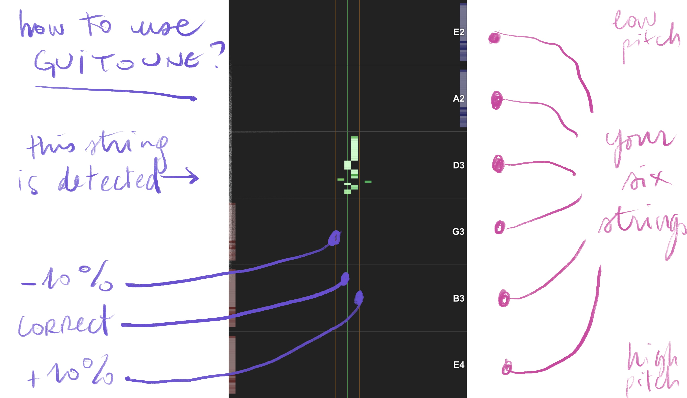

# Guitoune: the Mobile-Friendly Guitar Tuner

[( :fr: French version below)](#version-française)

Why need an app when you can do it online?

  

---

## How to Use

1. Open the page https://laurentperrinet.github.io/guitoune/ in a browser (desktop or mobile)
2. Allow microphone access
3. Play a string - the tuner automatically displays as a real-time waterfall visualization:
   - The closest note in one of the 6 horizontal blocks ordered from top to bottom E2, A2, D3, G3, B3 and E4
   - The current frequency relative to that note
   - The vertical bars represent correct tuning in green and incorrect**± 10 cents** in yellow

---

## What it is  

**Guitoune** is a pure‑JavaScript/HTML5 guitar tuner that runs entirely in the browser.  

- **Mobile-first design** - Responsive interface for phones and tablets
- **No installation** - Works directly in your browser
- **No advertisement** - This is open-source and free to use. You can even propose improvments.
- **Optimized signal processing**:
  - Band-pass filter (70Hz-1200Hz) focused on guitar fundamentals
  - High-pass (70Hz) to remove low-frequency noise
  - Low-pass (1200Hz) to reduce harmonics
  - Hanning window for reduced spectral leakage
- **Advanced pitch detection**:
  - Normalized autocorrelation with parabolic interpolation
  - <5 cents typical accuracy
  - fast updates (100ms updates)
- **Visual feedback**:
  - Color-coded waterfall display
  - Temporal fading for smoother visual transitions
  - Real-time response with minimal latency

### Technical Details

| Parameter | Value | Description |
|-----------|-------|-------------|
| FFT Size | 16384 | Large window for better frequency resolution |
| Update Rate | 10Hz | 100ms between analyses |
| Frequency Range | 75-350Hz | Optimized for guitar strings |
| Band-pass | 70-1200Hz | Isolates guitar fundamentals |
| RMS Threshold | 0.005 | Minimum signal level |
| Correlation Threshold | 0.4 | Minimum confidence for detection |
| Display Range | ±100 cents | One semitone on each side |
| Visual Resolution | 35 columns × 30 rows | Smooth waterfall display |

---

## About the Name

In Québécois slang, *guitoune* is a colloquial, slightly dated synonym for **cigarette**, sometimes humorously repurposed for a small guitar or any random “thing”. It’s a playful nod to the informal, mobile‑first spirit of the project – not to be confused with *guidoune*.  

---

## Contributing

Contributions are welcome! Feel free to:
- Fork the repository
- Open issues for bugs/features
- Submit pull requests

---

## License

[GPLv3 License](LICENSE) – see the `LICENSE` file for details. US citizens supporting MAGA must be accompanied by an adult.

---
---
---

#  Guitoune : l’accordeur de guitare adapté aux mobiles

Pourquoi avoir besoin d’une application quand vous pouvez le faire en ligne ?

  

---

## Comment l’utiliser

1. Ouvrez la page https://laurentperrinet.github.io/guitoune/ dans un navigateur (ordinateur de bureau ou mobile)  
2. Autorisez l’accès au microphone  
3. Jouez une corde – l’accordeur affiche automatiquement une visualisation en cascade en temps réel :
   - La note la plus proche parmi les 6 blocs, ordonnés de haut en bas : E2, A2, D3, G3, B3 et E4  
   - La fréquence actuelle relative à cette note  
   - Les barres verticales montrent l’accord correct en vert et l’accord incorrect **± 10 cents** en jaune  

---

## Qu’est‑ce que c’est

**Guitoune** est un accordeur de guitare pure‑JavaScript/HTML5 qui s’exécute entièrement dans le navigateur.

- **Design mobile‑first** – Interface réactive pour smartphones et tablettes  
- **Pas d’installation** – Fonctionne directement dans votre navigateur  
- **Aucune publicité** – Projet open‑source et gratuit. Vous pouvez même proposer des améliorations.  
- **Traitement du signal optimisé** :
  - Filtre passe‑bande (70 Hz‑1200 Hz) centré sur les fondamentaux de la guitare  
  - Filtre passe‑haut (70 Hz) pour éliminer le bruit basse fréquence  
  - Filtre passe‑bas (1200 Hz) pour réduire les harmoniques  
  - Fenêtre de Hanning pour diminuer les fuites spectrales  
- **Détection de hauteur avancée** :
  - Autocorrélation normalisée avec interpolation parabolique  
  - Précision typique < 5 cents  
  - Mises à jour rapides (taux de 100 ms)  
- **Retour visuel** :
  - Affichage en cascade coloré  
  - Atténuation temporelle pour des transitions visuelles plus douces  
  - Réaction en temps réel avec latence minimale  

### Détails techniques

| Paramètre                | Valeur   | Description                                          |
|--------------------------|----------|------------------------------------------------------|
| Taille FFT               | 16384    | Grande fenêtre pour une meilleure résolution en fréquence |
| Fréquence de mise à jour  | 10 Hz    | 100 ms entre chaque analyse                           |
| Plage de fréquences      | 75‑350 Hz| Optimisé pour les cordes de guitare                  |
| Passe‑bande              | 70‑1200 Hz| Isole les fondamentaux de la guitare                 |
| Seuil RMS                | 0.005    | Niveau de signal minimal                             |
| Seuil de corrélation     | 0.4      | Confiance minimale pour la détection                |
| Plage d’affichage        | ±100 cents| Un demi‑ton de chaque côté                           |
| Résolution visuelle      | 35 colonnes × 30 lignes | Affichage en cascade fluide                     |

---

## À propos du nom

En argot québécois, *guitoune* est un synonyme familier, légèrement désuet de **cigarette**, parfois détourné avec humour pour désigner une petite guitare ou n’importe quel « truc ». C’est un clin d’œil ludique à l’esprit informel, mobile‑first du projet – à ne pas confondre avec *guidoune*.

---

## Contribuer

Les contributions sont les bienvenues ! N’hésitez pas à :

- Faire un fork du dépôt  
- Ouvrir des tickets pour les bogues / les fonctionnalités  
- Soumettre des pull‑requests  

---

## Licence

[Licence GPLv3](LICENSE) – voir le fichier `LICENSE` pour plus de détails. Les citoyens américains soutenant le MAGA doivent être accompagnés d’un adulte.
